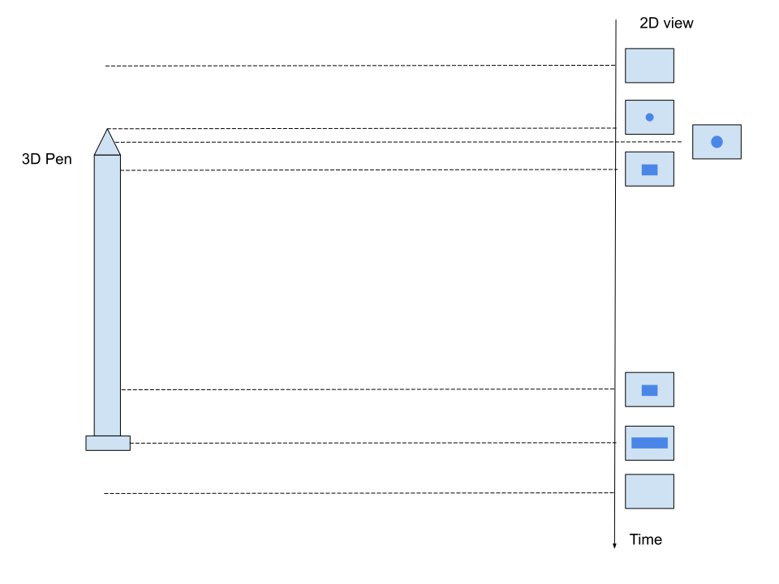
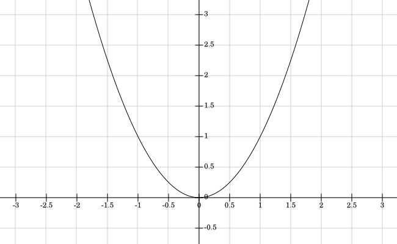
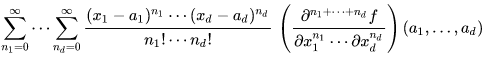

$$
\newcommand\underrel[2]{\mathrel{\mathop{#2}\limits_{#1}}}
$$


# Types of differentiation

There are 3 methods of computing the derivative of a function evaluate at a specific point :
- Symbolic
- Numérical
- Automactic Differentiation (AD)

## Symbolic differentiation

It's the same as we do when computing manually the derivative of a function to get its value at a specific point. We take the input expression and apply rules of differentiation such as :
- $$ \frac{d}{dx}f \times \frac{d}{dx}g = \frac{d}{dx}f \times g + \frac{d}{dx}g \times f $$
- $$ \frac{d\sin}{dx} = \cos $$
- $$\frac{d}{dx}\frac{f}{g} = \frac{ g \times \frac{d}{dx}f - f \times \frac{d}{dx}g }{g^2}$$

Symbolic computing takes as input an expression and then only use its symbolic representation for each operation (in other words, the program keeps using `x` instead of the value of `x` for computing). It's really helpful to get the exact form of a result since there cannot be any error of rounding or floating precision because no value is used at all.

For example, with Pyhton symbolic differentiation works as following :

```Python
import sympy as sym

x = sym.Symbol('x') # declare x as a symbolic variable
t = sym.Symbol('t')

f = sym.sin(x*(t**2)) # definition of the expression
f_prime = f.diff(x) # compute the symbolic form of the derivative (first order, aka df/dx) with respect to x
```

Then

```Python
print(f)
>> sin(t**2*x)
print(f_prime)
>> t**2*cos(t**2*x)
```

To get the value of the derivative at one point (replacing the symbolic representations of the variables with their respective values) :

```Python
# Evaluate the derivative of f with x=2, t=3
f_prime.evalf(subs={x: 2, t:3})
>> 5.94285037419672
```

The main issue with symbolic computing is that it needs to expand each expression to get its reduced form. For example $(x+y+z)^3$ expands to $x^2+2xy+y^2+2xz+2yz+z^2$. And that expansion/simplification has a prohibitive cost for longer expression.

And because of that overhead, time and resource consuming method, it's not the usual way to compute.

## Numerical differenciation

It's the go to method for computing derivative in a simple and fast way. But it comes with a trade off : precision. Numerical differenciation approximates numerically the value of the derivative but does not compute it's exact value.

Let's dig into how does it works.

### What is a derivative ?

First of all, we need to understand how derivative is defined to understand numerical differientiation. 

---
#### Definition of a function

A function describe a transformation/a relation from one set (in a mathematical sense) to another. For example, we could have a relation that give the coordinates of an object in the 2D plan with respect to time $t$. At any time $t$ the object has for coordinate $(C_x(t), C_y(t))$ (usually coordinate are represented by $(x(t), y(t))$ but in order to mitigate any doubts from notations we made a distinction here). $C_x$ and $C_y$ are two functions :

$$
\begin{cases}
C_x: 
    \begin{cases}
        \mathbb{R} \rightarrow \mathbb{R} \\
        t \longmapsto C_x(t)
    \end{cases} \\

C_y: 
    \begin{cases}
        \mathbb{R} \rightarrow \mathbb{R} \\
        t \longmapsto C_y(t)
    \end{cases}
\end{cases}
$$


The two functions could have for graphical representation the following graph : 

<p align="center">
    
</p>

Naturally we want to superimpose the two graph to see the evolution of the y coordinate with respect to the x coordinate (after all that the graph which really represent the motion of the object). 

Let's define, $X := \{{ C_x(t) | t \in Ker(C_x) \cap Ker(C_y) \}} = Im(C_x)$, $Y := \{{ C_y(t) | t \in Ker(C_x) \cap Ker(C_y) \}} = Im(C_y)$. Note that since $C_x$ and $C_y$ have the same Kernel (because they share the same time), $Ker(C_x) \cap Ker(C_y) = Ker(C_x) = Ker(C_y)$

Then, the corresponding composition function $C$ is :

$$
C: X \rightarrow Y
$$

where for $a \in X$, $f(a)=b \in Y$ with 
$$\begin{cases}
t \in Ker(C_x) \cap Ker(C_y) \\
a = C_x(t) \\
b = C_y(t) \\
\end{cases}$$

Note that $C$ is the function that map for the same moment in time $t$ the value of $C_x(t)$ to $C_y(t)$

$C$ can be written as :

$$
C:
\begin{cases}
X \rightarrow Y \\
a \mapsto C_y(C_x^{-1}(a))
\end{cases}
$$

With $C_x^{-1}$ the inverse image of $C_x$ by $X$

<p align="center">
    
</p>

#### History of derivative

The notion of derivatves is not so old and find its origin in the field of Physics.
The question was : from a specific time $t_1$ where the object will be a few moment after ? In a graphical way, how to approximate the graph after the time $t_1$ (based on the knowledge of the previous points) ?

The main hypothesis which is natural is to consider that there is not so much changes if the two points are really really close, then we can approximate the graph between the two point as a straight line. And that is the fondement of differientation.

Take a look at a potential graph of the function $C$. The goal is to find each quantity ```...``` (which could be different for each axis/dimension).

<p align="center">
    
</p>

For simplicity let's define $x_i:=C_x(t_i)$ and $y_i:=C_y(t_i)$. Note that $:=$ means that the equality is by definition.

In fact it's not really about the proximity of the points choosen but the time elapsed to go from $P_1:=(C_x(t_1)=x_1, C(C_x(t_1))=C_y(t_1)=y_1)$ and $P2:=(C_x(t_2)=x_2, C(C_x(t_2))=C_y(t_2)=y_2) := (x_1+..., y_1+...)$, with $t_2 := t_1 + o$ where $o$ is really really really small time quantity. 

---
#### Notion of speed and velocity

The first derivatives were used to explain the physical phenomena which intrinsically implies the evolution along time. A lot of the orgin of derivative is based things that are hard-wired to our daily experience of living.


##### Some words on Time

Time is the named of the concept that we need to explain the motion of objects. In fact, the correlation between time and movement of objects has been named motion.
We have an intrinsic understanding of time thanks to our body which has some [clock protein](https://kids.frontiersin.org/articles/10.3389/frym.2019.00005) which are  produced and broken down in a cycle that lasts 24h (which is called the circadian cycle). The only way for us to explain, measure the motion of an object is [time](https://iep.utm.edu/aristotle-motion/#H3). In fact, the simple fact to speak about deplacement and time is already a tautology.

The definition of time is just something that we can related to describe some phenomena whitout what we could not understand them. In fact, the actual [definition of time](https://www.nist.gov/how-do-you-measure-it/how-do-we-measure-time) is given by the [emission of radiation](https://en.wikipedia.org/wiki/International_Atomic_Time) from atoms that have a regular rate. Then this rate is ajust to match what we know being 24h hours (which is approximatively given by the clock protein that has probably matched the cycle of day/nigh in our planet).

[if time was a physcial dimension](https://www.youtube.com/watch?v=EedRLTlOp20&ab_channel=Scilabus) (4D) then we may not need this concept anymore because we could literrally see object evolving along that "time" dimension. But in our vision of world there is something missing to [explain motion](https://www.youtube.com/watch?v=NDYIdBMLQR0&ab_channel=argerichrichter1234).
A living being in a 2D world would need the concept of time to describe the third dimension that we have and that he's missing. For them, an object is describe by the time needed to entierly see it and the shape of projection of our 3D object into their 2D plan view (living in a 2D world means having a view in a 2D plan. It's the normal plan for them, but for us it's 2D relative to our 3D world).

<p align="center">
    
</p>

Time is quite the same thing as the axiom on top of what the euclidian geometry is built on. In particular, the 5th axiom, the [parallel postulate](https://en.wikipedia.org/wiki/Parallelpostulate) tells us :

```
If a line segment intersects two straight lines forming two interior angles on the same side that are less than two right angles, then the two lines, if extended indefinitely, meet on that side on which the angles sum to less than two right angles
``` 

And that postulate cannot be proven using the 4 others. Quite like time as been used has a "pseudo postule". Moreover, non euclidian geometries like the [riemnaien geometry](https://en.wikipedia.org/wiki/Riemannian_geometry) have a curved space where two parallel line can intersect each other (for a curved space observed inside our 3D world these line are intersecting but for a living being of that curved space they are absolutly not).

Time is usefull to resolve problem without really being able to define it. And maybe there is some other concept that describe motion better like other geometries better describe some problems.

---

Speed is a central concept in deriviative and it's build on top of motion. The definition of speed is a pretty old concept. For example <cite>[The Physics](http://classics.mit.edu/Aristotle/physics.7.vii.html)</cite> by Aristotle describes the notion of speed and velocity :

- ```[...] two things are of the same velocity if they occupy an equal time in accomplishing a certain equal amount of motion. [...] We may say, therefore, that things are of equal velocity in an equal time they traverse the same magnitude``` --- <cite>Book 7, part 4</cite>
- ```Then, A the movement have moved B a distance G in a time D, then in the same time the same force A will move 1/2B twice the distance G, and in 1/2D it will move 1/2B the whole distance for G: thus the rules of proportion will be observed``` --- <cite>Book 7, part 4</cite>

The speed is the amount of distance travelled with respect to the time elapsed. So why is it usefull ? Because from a point $t_a$ in time if we want to know the distance travalled to another moment $t_b$ you juste have to know the speed of the object at $t_a$(with the hypothesis that the speed at $t_a$ is representative of the average speed in $[t_a, t_b]$). The distance travelled is then $(t_b-t_a) \times speed|_{t_a}$.

This definition does not come from knowhere. It's comes because we have observed that an object at each point of the time has what we call speed/velocity which comes from the fact that the object is put in motion by a force (external or internal). 
Speed can be measured experimentally at "each" (at least at enough moments in time that we can no loger make a difference) points of time by taking some really small intervals of time ($\Delta_t$ really small) and measuring during that interval how much an object has moved.
Thus, the simple knowledge of that force (how much it's pushing the object and in what direction) give us a pretty rule of proportion (with the hypothesis that the force is contant : it's pushing with the same amount of strength, and in the same direction). 

Since we assume that the initial force is representative of the average force between $t_a$ and $t_b$, then we can appriximate the distance at $t_b$ only from the knowledge of the forces and position of the object (with its masse) at $t_a$.
In other words, it's strictly the same as drawing a straight line between two point. We juste have to know how the line is orientied and when to stop it.

Of couse this is not true in general : forces are not always constants and are usually not representative of the average speed. But it's quite true if the time elapsed between $t_a$ and $t_b$ is small enough. And experimental testing tends to confort that hypothesis. However, it was at least a starting point in history of speed an later derivative.

This short recap of history is only present to bring to the light the nature of speed which is not a tool complety invented but which is instrasically related to the Physics of our world. We observe that in some cases to push an object along the same distance (let say from point $A$ to $B$ in a straight line), we need to apply a force $F$ (let say a constant force) that will takes a specific time $t$ to move. And we observe that we can move that same object, along the same distance half the time of the first try, by applying the double of the force.
And to compare that two experiences, we need to compare how much the object has been moved at each moment. Some experiences could have different distance or different duration. So we need something that represent ratio to be able to compare them at each point of the time no matter the initial parameters (distance, duration, ...). That ratio is the today well known : $\frac{\Delta_d}{\Delta_t}$ where $\Delta_d$ is the total distance between $A$ and $B$, and $\Delta_t$ is the time elasped. That rate is then called speed.

Of course when the force is non constant, speed will change and the ratio $\frac{\Delta_d}{\Delta_t}$ can no longer be applied for the whole motion of the object because for certain moments/intervals of moments, this rate could be higer or lower than the previous or next moments. Then we understand why we need to repeat the same operation for lot of points of the curve with really small time intervals. But being in the scope of mathematic the "small" is in fact a limit : if we need to do the operation for a lot of points of the curve to gain accuracy, in fact we can go on for infinity (because the small interval can always be splitted in smaller interval for continuous function) and the only end is when we can have the speed of a single point (no more extremly small intervals that are representative of a specific point of the curve, just the speed for that single point at a single moment in time). This is what the limit represents.

By the way, what we have done for distance with respect to time (which give the speed) can also be done for its speed with respect to time which represents at each moment how much the speed changes (which is called acceleration).

In conclusion :

```
the speed is the instantenious rate of change of the distance with respect to the time
```

---
#### Derivative definition

Going back to our initial problem, by knowing the speed of an object at a specific point, we then can determine form a specific point what will be its next position.

If we take a one dimensional example (our object is only moving along a line)

<p align="center">
    
</p>

Then $(x_1+...) = x_1 + speed|_{t_1} \times o$ where $speed|_{t_1}$ is the speed of the object at the moment $t_1$ and $o$ that really small quantity ($o \neq 0$) in time. We take two moment in time really close and we suppose that all the forces and constraints remain the same during that really small change in time. Then we can apply a basic rule of proportion. Historycally, the speed or [velocity](https://en.wikipedia.org/wiki/Velocity) (the directional speed/the speed along a specific axis, along a specific degree of freedom of the object) is noted $\dot{x}$ (for the speed along the $x$ axis).


The, we can write $P_2$ as $(x_1 + \dot{x_1} \times o, y_1 + \dot{y_1} \times o)$. Note that $\dot{x_1} = \dot{C_x(x(t_1))} = speed|^x_{t_1}$ is the speed of the object along the $x$ axis at the time $t_1$. This is the notation used by Newton (see [1](http://www.sfu.ca/~rpyke/fluxions.pdf),[2](https://www.youtube.com/watch?v=i5TFXyI4UMM&ab_channel=Mathoma)) when he first introduces the derivative or its own version of derivative. The quantities along $x$, $y$ was called `flowing` or `fluent` and the corresponding velocity was called `fluxion`. The `moment` is the `fluxion` $\times$ `time`.

If we calculate the slope $\alpha_{P_1}$ of the line made between $P_1$ and $P_2$ we will find :
$$
\begin{split}
\alpha_{P_1} &= \frac{C(x_2)-C(x_1)}{x_2-x_1} \\
&= \frac{ C(x_1 + \dot{x_1} \times o) -C(x_1)}{\big( x_1 + \dot{x_1} \times o \big) -x_1} \\
\end{split}
$$

Since by hypothesis ($y_2 = y_1 + ...$), then by identification $y_2=C(x_1 + \dot{x_1} \times o)=y_1 + \dot{y_1} \times o$. Note that, this brings to the light the following relation : $C(x_1 + \dot{x_1} \times o) = C(x_1) + \dot{C(x_1)} \times o$ which remind us the [Taylor expansion](https://en.wikipedia.org/wiki/Taylor_series) of first order ! Of course at that step we still don't know what is a derivative but...

Then, 

$$
\begin{split}
\alpha_{P_1} &=

\frac{ \big( y_1 + \dot{y_1} \times o \big) - y_1}{\big( x_1 + \dot{x_1} \times o \big) -x_1} \\

\end{split}
$$

Since $o \neq 0$ : 

$$
\alpha_{P_1} = \frac{\dot{y_1}}{\dot{x_1}}
$$

Since $\dot{y_1}$ is the velocity along the $y$ axis at the time $t_1$, then $\dot{y_1} = \frac{\Delta_y}{\Delta_t}|_{t_1}$, then :
$$
\alpha_{P_1} = \frac{\Delta_y}{\Delta_x} \big|_{t_1}
$$

When $o$ is infinitesimally small $\alpha_{P_1}$ becomes the slope of the tangente at $P_1$. And we observe that $P_2$ is just a point along the tangente really close to $P_1$. In other words, we find a straight line that allow use to approximate where the next point will be on the graph of $C$.

Later, $\alpha_{P_1} = \frac{\dot{y_1}}{\dot{x_1}}$ was called a derivative.

In conclusion :
```
the derivative of y is the instantaneous rate of change of y with respect to point x
```

Derivatives has then been generalized and applied to other fields than Physics where the notion of speed is no more definied in a Physics way but where it's described as the instantaneous rate of changes in a function. But the underlaying concept comes from observation of our world.

---
#### Some Notations

Usually, we note $C_x$ as $x$ (which must not be mingled with the $x$ axis), $C_y$ as $y$ and $C$ as $f$.

Nowadays, we would write :
- $$ o \rightarrow dt $$
- $$ \dot{y_1} \rightarrow \frac{dy}{dt}|_{t_1} $$
- $$ \dot{x_1} \rightarrow \frac{dx}{dt}|_{t_1} $$
- $$ \dot{x_1} \times o \rightarrow \frac{dx}{dt}|_{t_1} \times dt  \rightarrow dx $$
- $$ \dot{y_1} \times o \rightarrow \frac{dy}{dt}|_{t_1} \times dt  \rightarrow dy $$
- $$ \alpha_{P_1} \rightarrow \frac{dy}{dx}|_{t_1} $$ 
($\frac{dy}{dx}$ remains a function of $t$ here, because $x: t \mapsto x(t)$ and $y: t \mapsto y(t)$ are functions of $t$. Formally we would have to write $\frac{dy(t)}{dx(t)}|_{t=t_1}$, or $\frac{dy}{dx}(t)|_{t=t_1}$ )

$dx$, $dy$, $dt$ are called the differential of the variable $x$, $y$, $t$. Which basically  [represent the infinitesimally step](https://math.stackexchange.com/questions/200393/what-is-dx-in-integration) in the $x$, $y$, $z$ direction. 

---
#### Derivative calculation

But one question remains : how to derivative is foramlly calculated from explicit expression like $x + 2y$ ?

The Newton notation can be applied to arbitrary function with a defined expression. For example, let's take $y = x^2$ which give us a parabola curve :


<p align="center">
    
</p>

The derivative of $y$ with respect to $x$ is obtained by replacing $x$ by a small change along that its direction $x \rightarrow x + \dot{x} \times o$, same for y with $y \rightarrow y + \dot{y} \times o$ and then :

$$
\begin{split}
y = x^2 & \leftrightarrow  (y + \dot{y} \times o) = (x + \dot{x} \times o)^2 \\

& \leftrightarrow  (y + \dot{y} \times o) = x^2 +2x\dot{x}o + o^2 \\

& \leftrightarrow  (y - x^2) + \dot{y} \times o = 2x\dot{x}o + o^2 \\

\end{split}
$$

Since $y=x^2$, then :


$$
\begin{split}

(y - x^2) + \dot{y} \times o = 2x\dot{x}o + o^2 & \leftrightarrow \dot{y} \times o = 2x\dot{x}o + o^2 \\

\end{split}
$$

And because $o \neq 0$ : 


$$
\dot{y} = 2x\dot{x} + o
$$

And because $o$ is infinitesimally small we can ignore it. Then we end up with :

$$
\begin{split}

\dot{y} = 2x\dot{x} & \leftrightarrow \frac{\dot{y}}{\dot{x}} = 2x\\

& \leftrightarrow \frac{dy}{dx} = 2x\\

\end{split}
$$

Which is excaltly what today we know being the derivative of $x^2$.

During the calculation of the derivative I used $\leftrightarrow$ instead of $\Leftrightarrow$. It's because at one point we say $o \neq 0$ to divide by $o$ and then later because $o$ is small we can ignore it (meaning $o=0$). That excatly what [Leibniz blame Newton's theory](https://en.wikipedia.org/wiki/History_of_calculus) for (it was not only focus on the use of infinitesimally quantity. For more context see [Leibniz–Newton calculus controversy](https://en.wikipedia.org/wiki/Leibniz%E2%80%93Newton_calculus_controversy)). And that's also why today we do not make calculation with infinitesimally quanties (dx, dy, dt) as a "number" but we use the notion of limits.

Nowdays we will write :

$$
\begin{split}

\frac{dy}{dx} &= \alpha_{P_1} \\

&= \lim_{ h \to 0} \frac{f(x + h) - f(x)}{h} \\

& \underrel{h \to 0}{=} \frac{f(x + h) - f(x)}{h} + o(h)  \\

\end{split}
$$

Where $o(h)$ is the [Landau notation](https://simple.wikipedia.org/wiki/Big_O_notation) (and not the Newton's $o$ notation).


$$
\begin{split}

\frac{dy}{dx} & \underrel{h \to 0}{=} \frac{f(x + h) - f(x)}{h} + o(h)  \\

&\Leftrightarrow f(x + h) \underrel{h \to 0}{=}  f(x) + \frac{dy}{dx} \times h - o(h) \\

&\Leftrightarrow  f(x + h) \underrel{h \to 0}{=} f(x) + \frac{dy}{dx} \times h + o(-h) \\

&\Leftrightarrow  f(x + h) \underrel{h \to 0}{=} f(x) + \frac{dy}{dx} \times h + o(h) \\

&\Leftrightarrow  f(x + h) \underrel{h \to 0}{=} f(x) + \frac{d}{dx}f \times h + o(h) \\

\end{split}
$$

Which is the first order Taylor expansion of $f$.

---
#### Derivative computation

Now, how computer compute derivatives numerically ? As we would do with any given curve, or experimentally : take a relly small step in the input set of the function and use :

$$
\frac{f(x+h) - f(x)}{h} \approx f'(x) = \frac{df}{dx}
$$

Because $o(h)$ is so small that it can be ignored when $h \rightarrow 0$. Ususally $h=10^{-6}$ in computer programs.

For example with $f: x \mapsto x^2$ the value of the derivative at the point $x=3$ is with $h=10^{-6}$

$$
\begin{split}

\frac{f(3+10^{-6})-f(3)}{10^{-6}} &= \frac{(3+10^{-6})^2 - 9}{10^{-6}}\\

&= \frac{9,000006 - 9}{10^{-6}}\\

&= \frac{0,000006}{10^{-6}}\\

&= 6,000001 \\

&\approx 2 \times 3 \\

\end{split}
$$

The we need to do that for each desired points $x$

The main issue with this method is the precision of the result because some numbers [cannot](https://math.stackexchange.com/questions/943589/how-many-numbers-can-a-typical-computer-represent) be represented excalty in computer, and there are somes [error](https://docs.oracle.com/cd/E19957-01/806-3568/ncg_goldberg.html) which propagate in each operation made (rounding error, catastrophic cancellation, ...). [Standards](https://en.wikipedia.org/wiki/IEEE_754) are defined to make computation with number replicable.
Theses issues are avoided by symbolic differientiation because there is no value at all, thus the computation is exact.

## Automatic Differientiation

There is two modes of operation for AD : forward and bacward mode.

---
### Forward mode

To explain the AD forward mode we need to temporarily focus on integral.

#### Integration of a function

The integral of a function $f$ from $x_a \in Ker(f)$ to $x_b \in Ker(f)$, noted $\int_{x_a}^{x_b} f(x)dx$, is by definition the area under that curve 

<p align="center">
    
</p>

Here, $A := (x_a, y_a:=f(x_a))$ and $B := (x_b, y_b:=f(x_b))$

There is lot of definition of integral but the simplest is the [Riemann](https://en.wikipedia.org/wiki/Riemann_integral) one. The basic idea behing Riemann integral is to split the interval $[A, B]$ into small rectangle. If we split this interval into small enough rectangle then the sum will have for limits the area under the curve.

Let's take a look at a zopm of the graph of $f$ around the point $A$
<p align="center">
    
</p>

We approximate the area under $A$, $A'$ by the area of the rectangle with height $f(x_a)$. Then the area for that rectangle is : $f(x_a) \times (x_{a'} - x_a)$.

---
#### Integral of derivative

The [fundamental theorem of calculus](https://en.wikipedia.org/wiki/Fundamental_theorem_of_calculus) (FTOC) give us : 
$$ \int_a^b (\frac{d}{dx}f)dx = f(b) - f(a) $$

Remember that the two $dx$ are quite not the same and we can not "simplify$ by it. The $dx$ in the integral represents along which direction ($x$ axis) we integrate $f$.

But why is it true ?

Let's define $\mathcal{A}(x)_f$ the area of $f$ from $c \in Ker(f)$ as is the first defined value for $f$ with $c \geq 0$, to $x \in Ker(f)$. If $f$ is defined at $0$, then $c=0$. In other words, $\mathcal{A}(x)_f = \int_c^{x}f(x)dx$

As $A$ and $A'$ and $A'$ are really close, then, $A' := (x_a+h, f(x_a+h))$ with $h \neq 0$ as $(x+h) \in Ker(f)$.

The area from $A$ to $A'$ is then : $\mathcal{A}(x_a+h)_f - \mathcal{A}(x_a)_f$

$$ 
f(x_a +h) \times ( (x_a+h)-x_a) < \mathcal{A}(x_a+h)_f - \mathcal{A}(x_a)_f < f(x_a) \times ( x_a-(x_a+h))
$$

$$ 
f(x_a +h) \times h < \mathcal{A}(x_a+h)_f - \mathcal{A}(x_a)_f < f(x_a) \times h
$$

$h \neq 0$ :

$$ 
f(x_a +h) < \frac{\mathcal{A}(x_a+h)_f - \mathcal{A}(x_a)_f}{h} < f(x_a)
$$

When $h \rightarrow 0$ :

$$
\begin{cases}
f(x_a +h) \rightarrow f(x_a) \\
f(x_a) \rightarrow f(x_a) \\
\frac{\mathcal{A}(x_a+h)_f - \mathcal{A}(x_a)_f}{h} \rightarrow (\frac{d}{dx} \mathcal{A}(x)_f)|_{x=x_a}
\end{cases}
$$

Then,

$$ 
f(x_a) \leq (\frac{d}{dx} \mathcal{A}(x)_f)|_{x=x_a} \leq f(x_a)
$$

Thus,

$$
(\frac{d}{dx} \mathcal{A}(x)_f)|_{x=x_a} = f(x_a)
$$

Since $x_a$ has been choosen arbitrarily, then :

$$
\frac{d}{dx} \mathcal{A}(x)_f = f
$$

With the usual notation we have for $f$ continious on $[a, x]$ :

$$
\begin{cases}
F(x) = \mapsto \int_a^x f(x)dx \\
\frac{d}{dx}F = f
\end{cases}
$$

---
#### Taylor serie

For $f: \mathbb{C} \rightarrow \mathbb{R}$ infinitely differentiable at $a \in \mathbb{C}$ we have the following [Taylor power serie](https://en.wikipedia.org/wiki/Taylor_series) :

$$
f(x) = \sum_0^\infty  \frac{f^n(a)}{n!} (x-a)^n 
$$

where $f^n(a)$ denotes the nth derivative of $f$ evaluated at the point $a$ and $f^0(a)=f(a)$.

An excellente proof is given [here](https://math.stackexchange.com/a/3261420/998679)

---
#### Dual number

[Dual numbers](https://en.wikipedia.org/wiki/Dual_number) are the key to AD forward mode. A dual number is define as a real part (called the primal part) and a dual part (called the tangant part) : 

$$
a + b\epsilon
$$

where :

$$
\begin{cases}
a,b \in \mathbb{R} \\
\epsilon \neq 0 \\
\epsilon^2 = 0
\end{cases}
$$


Dual numbers are part of the family of hypernumbers as complex numbers are.
The definition of dual number can be quite out of context but as complex numbers it has an history. To better understand of such number are discovered take a look at the excelleten [video](https://www.youtube.com/watch?v=cUzklzVXJwo&ab_channel=Veritasium) of Veritasium.

To better understand how calculus is done with dual number take a look [here](https://www.youtube.com/watch?v=ceaNqdHdqtg&t=319s&ab_channel=MichaelPenn).

[History of dual number](https://math.stackexchange.com/questions/341535/is-the-theory-of-dual-numbers-strong-enough-to-develop-real-analysis-and-does-i) can be linked to Newton calculus when in some calculation the term $dx^2$ was ignored (meaning $dx=0$) while $dx \neq 0$. 

So why dual number usefull for differentiation ?

Because for any function that admin a Taylor expansion we have for $x=a+\epsilon$ where $a$ is the differentiable point of f :

$$
\begin{split}
f(x) = \sum_0^\infty  \frac{f^n(a)}{n!} (x-a)^n  &\Leftrightarrow \\

f(a+\epsilon) = \sum_0^\infty  \frac{f^n(a)}{n!} (\epsilon)^n &\Leftrightarrow \\

f(a+\epsilon) = f(a) + \frac{df}{dx}(a) \epsilon + \sum_2^\infty  \frac{f^n(a)}{n!} \epsilon^n
\end{split}
$$

Since for $n \geq 2$, $\epsilon^n = 0$, the :

$$
f(a+\epsilon) = f(a) + \frac{df}{dx}(a) \epsilon
$$

Thus, by computing tne value of $f$ at $a+\epsilon$ we have the value of $f$ at $a$ and the exact value of the derivative of $f$ at $a$. Note that, this is not an approximation but an exact value as if it was obtains with symbolic differientiation.

Denote that we can take a dual number as a complex number and use it as input for any function since all usual operations in the rings are defined (see [1](https://math.stackexchange.com/questions/464262/why-is-there-never-a-proof-that-extending-the-reals-to-the-complex-numbers-will), [2](https://www.arctbds.com/volume4/arctbds_submission_28.pdf)). We just need to use a norm (which has a continiuty property) for comparaison.

---
#### Gradient

Let's focus on a more general case : multivariable scalar function, also called scalar field function. As its name stand for a multivariable scalar function is a function $f : \mathbb{R}^n \rightarrow \mathbb{R}$ that takes as argument different variable $x$, $y$, $z$, ... and ouput a scalar in $\mathbb{R}$ or $\mathbb{C}$. For example the following function is a scalar field :

$$
f : 
\begin{cases}
\mathbb{R} \rightarrow \mathbb{R} \\
(x, y) \mapsto \sin(x) \times y \\
\end{cases}
$$

Then to talks about derivatives we need to know on which variable we want to focus : $x$, $y$, $z$. In other words the single case variable function derivatives extends to multivariabvles by taking derivatives of the function for each variable. A derivative with respect to a variable is called a [partial derivative](https://en.wikipedia.org/wiki/Partial_derivative) and usally denoted as $\frac{\partial{f}}{\partial{x}}$, $\frac{\partial{f}}{\partial{y}}$, $\frac{\partial{f}}{\partial{z}}$, ...

Formally the diretionnal derivative (if exists) is defined for $f$ at $a$ with respect to $x$ :

$$
\frac{\partial{f}}{x}(a_x, a_y, a_z, ...) = \lim_{ h \to 0} \frac{f(a_x+h, a_y, a_z, ...)-f(a_x, a_y, a_z, ...)}{h}
$$

Having all well defined partial derivatives at $a$ does not means the function is differnetiable at that point ! If $f$ is continious at $a$ then its differientiable at $a$. But continious then differentiable is given by another theorem and differentiability can be obtains without it (by the [definition](https://en.wikipedia.org/wiki/Differentiable_function) for example, which imply the knowledge of topology).

We denote as [gradient](https://en.wikipedia.org/wiki/Gradient) the vector of partial derivatives : $ \nabla f := (\frac{\partial{f}}{\partial{x}}, \frac{\partial{f}}{\partial{y}}, \frac{\partial{f}}{\partial{z}},...)$. It could be a line or a column vector and we go from one form to another with the [transpose](https://en.wikipedia.org/wiki/Transpose) : 

$
\begin{bmatrix}
    \frac{\partial{f}}{\partial{x}} \\
    \frac{\partial{f}}{\partial{y}} \\
    \frac{\partial{f}}{\partial{z}} \\
    \vdots \\
\end{bmatrix}^T = [\frac{\partial{f}}{\partial{x}}, \frac{\partial{f}}{\partial{y}}, \frac{\partial{f}}{\partial{z}},...]
$

We usually talks about gradient for [vectorial spaces](https://en.wikipedia.org/wiki/Vector_space) when dealing with commun functions. A vectorial space has a dimension denoted $n$ which describes the number of possibles directions along which we could move and that define the space at the most elementary level. For example, $\mathbb{R}$ is a vectorial space of dimension 3 : $x$, $y$, $z$. We could also imagine a 4th direction that make a diagonal in the $x,y$ plan but then it would be a combinaison of the 3 previous directions. Since $x$, $y$, $z$ cannot be expressed as a combinaison of other element inside that space it's forming the axis/direction of the space. Together theses axis are forming a family of the vector space and are usually denotes as $(e_1, e_2, e_3, ...)$. 

Each element $a$ of the vector space can be written as a combinaison of a family of the vector space as $a = \sum_{i=0}^{n} a_i \times e_i$ with $a_i$ the composante of $a$ along the $e_i$ direction. For the common 2D and 3D vectorial space $(e_1, e_2, e_3)$ are denotes as $(\vec{i}, \vec{j}, \vec{k})$.

Since the $gradient$ is a vector we can express it through the axis of the output space as :

$$
[\frac{\partial{f}}{\partial{x}}, \frac{\partial{f}}{\partial{y}}, \frac{\partial{f}}{\partial{z}},...] 

\times

\begin{bmatrix}
    \vec{i} \\
    \vec{j} \\
    \vec{k} \\
    \vdots \\
\end{bmatrix}

= \frac{\partial{f}}{\partial{x}}\vec{i} + \frac{\partial{f}}{\partial{y}}\vec{j} + \frac{\partial{f}}{\partial{z}}\vec{k} + ...
$$

And abusively we just write $\frac{\partial{f}}{\partial{x}} + \frac{\partial{f}}{\partial{y}} + \frac{\partial{f}}{\partial{z}}$. But the gradient is not a number !

---
#### Directional derivative

If the partial dirivative of a function represents the rate of change of that function along the corresponding direction, then the [directionnal derivative(https://www.youtube.com/watch?v=N_ZRcLheNv0&ab_channel=KhanAcademy) represents the rate of change of the function along an arbitrary choosen direction.

For 
$v= \in \begin{bmatrix}
    v_x \\
    v_y \\
    v_z \\
    \vdots \\
\end{bmatrix} \mathbb{R}^n$ 
the directionnal derivative of $f$ for any $a \in \mathbb{R}^n$ is :

$$
\nabla_{v}f(a) = \lim_{h \rightarrow 0} \frac{f(a+hv)-f(a)}{h}
$$

Remind that $h$ is a scalar

[And](https://en.wikipedia.org/wiki/Directional_derivative), $\nabla_{v}f(a) + ...$

Here, the directionnal derivative is a scalar which is the sum of all partial derivative with respect to each axis defined by the directionnal vector $v$ (it's a dot product - the multiplication extension to vector).

$$
v \times \nabla f(a) = v_x \times \frac{\partial{f}}{\partial{x}}(a) + v_y \times \frac{\partial{f}}{\partial{y}}(a) + v_z \times \frac{\partial{f}}{\partial{z}}(a) 
$$

---
#### Jacobian

The gradient is in fact a particular case of the [Jacobian](https://en.wikipedia.org/wiki/Jacobian_matrix_and_determinant). The Jacobian is the same thing as the gradient bu defined for function with multiple output value $f : \mathbb{R}^n \rightarrow \mathbb{R}^m$. Such a function is decomposed for each composant of the output as a new function :

$$
f : 
\begin{cases}
\mathbb{R}^n \rightarrow \mathbb{R}^m \\
\begin{bmatrix}
    x_1 \\
    x_2 \\
    \vdots \\
    x_n
\end{bmatrix} \mapsto

\begin{bmatrix}
    f_1(x_1, x_2, ..., x_n) \\
    f_2(x_1, x_2, ..., x_n) \\
    \vdots \\
    f_m(x_1, x_2, ..., x_n) \\
\end{bmatrix}

\end{cases}
$$

Fo example $f$ can be :

$$
f : (x,y) \mapsto (x \times y, \cos(x))
$$

And if you think of $f$ as the application of a single function $\sin$ for example to a vector, we get a vector that can aslo be described as different function :

$$
f : 
\begin{bmatrix}
    x \\
    y \\
\end{bmatrix}
 \mapsto \sin \big(
    \begin{bmatrix}
    x \\
    y \\
    \end{bmatrix}
 \big) = \begin{bmatrix}
    \sin(x) \\
    \sin(y) \\
\end{bmatrix}
:= \begin{bmatrix}
    f_1(x, y) \\
    f_2(x, y) \\
\end{bmatrix}
$$

In fact, all functions than we can think of are built in the scenario of single variable function and then generelized for multivaribale function usually by applying that function for each component. 

The Jacobian of a multivariable function is then :

$$
\begin{bmatrix}
    \frac{\partial{f_1}}{x_1}(x_1, x_2, ..., x_n) & \frac{\partial{f_1}}{x_2}(x_1, x_2, ..., x_n)  & ... & \frac{\partial{f_1}}{x_n}(x_1, x_2, ..., x_n) \\

    \vdots & \vdots & \vdots & \vdots \\

    \frac{\partial{f_m}}{x_1}(x_1, x_2, ..., x_n) & \frac{\partial{f_m}}{x_2}(x_1, x_2, ..., x_n)  & ...  &\frac{\partial{f_m}}{x_n}(x_1, x_2, ..., x_n) \\
\end{bmatrix}
$$

Now let's extand the Taylor serie for scalar field function. Let's define $f : \mathbb{R}^n \rightarrow \mathbb{R}$ a scalar field function.

Remember that the goal is the get the Taylor expension for scalar field function to extand the use of dual number to such a function. Then we just need to get the expension to the 2nd order as seen previously. In fact there is a complete formula of Taylor serie for multivariable function but it comes without real context :


<p align="center">
    
</p>

The proof made previously with integral could possibly also be done like that, but we will need to use [line integral](https://en.wikipedia.org/wiki/Line_integral) (use for integral of multivariable function) which is an overhead.

In fact, there is [more elegant and simple proof](https://math.stackexchange.com/questions/221669/derivation-of-multivariable-taylor-series) at least for our use case.

Let's consider $f$ a $C^2$ scalar field function ($f$ is continious and its derivatives up to the 2nd orders are continious). The proof could be made with less powerfull asymption but will be harder to write and understand.

The directionnal derivative of $f$ in the direction defined by $a \in \mathbb{R}^n$ at $r \in \mathbb{R}^n$ arbitrary choosen :

$$
a \times \nabla f(r) = \lim_{h \rightarrow 0} \frac{f(r+ha)-f(r)}{h}
$$

Now let's consider :
$
g : \begin{cases}
\mathbb{R} \rightarrow \mathbb{R} \\
h \mapsto f(r+ha)
\end{cases}
$

$g$ is a single variable function since $r$ and $a$ are fixed. The only changing par is $h$. And since $f$ is a scalar field, then $f(r+ah) \in \mathbb{R}$.

Let's suppose that $f$ is 2-differentiabled ($f$ admit at least derivatives of the 2nd order at $r$). Then $f$ is continious at $0$, thus $g$ is continious at $0$ and admit derivative of the 2nd order.

Then since $g$ is a 1-dimensionnal function we can use the Taylor serie expeansion for any $h \mathbb{R}$ :

$$
g(h) = g(0) + g'(0)h + \frac{1}{2}g''(0)h^2 + ...
$$

- 
$$
g(0) = f(r+a \times 0) = f(r)
$$
- for $x \in \mathbb{R}$ arbitrary choosen (then, since $f$ is continious) :
$$
\begin{split}

g'(x) &= \lim_{l \rightarrow 0} \frac{g(x+l)-g(x)}{l} \\

&=  \lim_{l \rightarrow 0} \frac{f(r+(x+l)a)-f(r+xa)}{l} \\
\end{split}
$$ 
Let's consider $X := r+xa$, then
$$
\begin{split}

g'(x) &= \lim_{l \rightarrow 0} \frac{f(X+la)-f(X)}{l} \\

&=  \nabla_{a} f(X) \\

&=  \nabla_{a} f(r+xa) \\

\end{split}
$$ 

- 
$$
g'(0) = \nabla_{a} f(r+0 \times a) =  \nabla_{a} f(r) = a \nabla f(r)
$$

- 
$$
\begin{split}
g''(0) &= \lim_{l \rightarrow 0} \frac{g'(0+l)-g'(0)}{l} \\

&= \lim_{l \rightarrow 0} \frac{\nabla_{a} f(r+la)-\nabla_{a} f(r)}{l} \\

\end{split}
$$

Let's consider 
$
\phi : \begin{cases}
\mathbb{R}^n \rightarrow \mathbb{R} \\
x \mapsto \nabla_{a} f(x)
\end{cases}
$

Since the directionnal derivative is a linear combinaison of the partial derivatives and since $f$ is $\mathbb{C}^2$, then $\nabla_{a} f$ is differentiable and continious. Thus, 

$$
\begin{split}
g''(0) &= \lim_{l \rightarrow 0} \frac{\phi(r+la)-\phi(r)}{l} \\

&= \nabla_{a} \phi(r) \\

\end{split}
$$

$g''(0)$$ is the directionnal derivative of the directionnal derivative of $f$ at $r$ along the direction of $a$. It's denoted as $\nabla_{a}^2 f(r)$ or $\nabla_{a} \nabla_{a} f(r)$.

Then,


Then,

$$
\begin{split}
g(h) = f(r) + \nabla_{a}f(r)h + \nabla_{a}^2 f(r)h^2 + \mathcal{o(h^2)} &\Leftrightarrow \\

f(r+ha) = f(r) + \nabla_{a}f(r)h +  \nabla_{a}^2 f(r)h^2 + \mathcal{o(h^2)} \\
\end{split}
$$

Since $r$, $a$, $h$ were arbitrary choose, thus for $h=0+\epsilon$ :

$$
f(r+a \epsilon) = f(r) + \nabla_{a}f(r)\epsilon + 0
$$

Then the dual number trick can also be applied to scalar field function. For 
$
a = \begin{bmatrix}
1 \\
0 \\
\vdots \\
0
\end{bmatrix}
$, we get :

$$
f(r+a \epsilon) = f(r) + \frac{\partial{f}}{\partial{x_1}}\epsilon
$$

where $x_1$ is the 1th variable of the function $f$.

Finally, for multivariable function we need to compute each partial derivative through the use of dual number.

---
#### Hessian

For $f: \mathbb{R}^n \rightarrow \mathbb{R}$ the Taylor expansion at $a \in \mathbb{R}$ for $x \in \mathbb{R}^n$ is  :

$$
f(x) = f(a) + \nabla f(a)(x-a) + \frac{1}{2}(x-a)^T Hf(a)(x-a) + \mathcal{o((x-a)^2)}
$$

where $Df$ is the gradient of $f$ and $Hf$ the hessian of $f$ (which is the "derivative" of the 2nd order of $f$)

$$
Hf= \begin{bmatrix}
\frac{\partial^2{f}}{\partial{x_1}^2} & \frac{\partial^2{f}}{\partial{x_1}\partial{x_2}} & ... & \frac{\partial^2{f}}{\partial{x_1}\partial{x_n}} \\

\frac{\partial^2{f}}{\partial{x_2}\partial{x_1}} & \frac{\partial^2{f}}{\partial{x_2}^2} & ... & \frac{\partial^2{f}}{\partial{x_2}\partial{x_n}} \\

\vdots & \vdots & \vdots & \vdots \\

\frac{\partial^2{f}}{\partial{x_n}\partial{x_n}} & \frac{\partial^2{f}}{\partial{x_n}\partial{x_n}} & ... & \frac{\partial^2{f}}{\partial{x_n}^2} \\

\end{bmatrix}
$$

For 
$
f: \begin{cases}
\mathbb{R}^n \rightarrow \mathbb{R}^m \\
x \mapsto (f_1(x), f_2(x), ..., f_m(x))
\end{cases}
$ the hessian is : $Hf = (Hf_1, Hf_2, ..., Hf_m)$ a [tensor](https://en.wikipedia.org/wiki/Tensor). A tensor is a n-dimensionnal structure that holds data and adapts it to the transformation of the surrounding space where the tensor live. For example, with a tensor no matter how the usual 3D space coordinate system is oriented, rotated, translated, the value inside the tensor will represents the same thing by adpting the inner value seemingless adapting to the transformation. So it's not just a matrix (see [1](https://www.youtube.com/watch?v=bpG3gqDM80w&ab_channel=TheScienceAsylum), [2](https://medium.com/@quantumsteinke/whats-the-difference-between-a-matrix-and-a-tensor-4505fbdc576c)).

[Here](https://math.stackexchange.com/questions/1822100/how-to-do-a-taylor-expansion-of-a-vector-valued-function) is an example of such a hessian.

---
#### Matrix

For $f: \mathbb{R}^{n \times m} \rightarrow \mathbb{R}^{p \times q}$ function fo matrices things get more complicated for the Taylor serie since the multiplication of matrix is not commutative. 

However, the Taylor serie can be generelized to many other objects (see [1](https://math.stackexchange.com/questions/4177818/taylor-series-coordinate-free-form/4177847#4177847), [2](https://math.stackexchange.com/questions/3271948/proving-limit-of-fx-tnfx-taylor-is-zero-in-multivariable-calculus/3272515#3272515)).

----
#### Implementation

Finally, the forward mode of Automatic differientiation is the use of dual number to get one by one the partial derivative. This is can be achieved programatically by overloading operators and function in the programming langage.

For example in Python we can defined a new class ```DualNumber``` as follow : 

```Python
class DualNumber:
    def __init__(self, primal, tangent=1):
        self.primal = primal # real part
        self.tangent = tangent # dual part
    
    def __add__(self, v):
        # right addition : current_object + input object
        if type(v) is DualNumber:
            return DualNumber(self.primal+v.primal, self.tangent+v.tangent)
        else: # scalar addition
            # In fact we should have checked the type of the input object for int/float
            # but other operation with specific object could be defined and allow them avoid having to rewrite that class exception
            return DualNumber(self.primal+v, self.tangent)
    
    def __mul__(self, v):
        # right multiplication : current_object x input object
        if type(v) is DualNumber:
            return DualNumber(self.primal*v.primal, self.primal*v.tangent + self.tangent*v.primal)
        else: # scalar multiplication
            return DualNumber(self.primal*v, self.tangent*v)
    
    def __sub__(self, v):
        # right subtraction : current_object - input object
        if type(v) is DualNumber:
            return DualNumber(self.primal - v.primal, self.tangent - v.tangent)
        else: # scalar substraction
            return DualNumber(self.primal - v, self.tangent)
    
    def __truediv__(self, v):
        # numerator division : current_object / input object
        if type(v) is DualNumber:
            dem = v.primal**2
            val = self*DualNumber(v.primal, -v.tangent)

            return DualNumber(val.primal/dem, val.d/dem)
        else:
            return DualNumber(self.primal/v, self.tangent/v)

    def __rmul__(self, v):
        # left scalar mutiplication : scalar x current_object
        return DualNumber(self.primal*v, self.tangent*v)
    
    def __radd__(self, v):
        # left scalar addition : scalar + current_object
        return DualNumber(self.primal+v, self.tangent)
    
    def __rsub__(self, v):
        # left scalar substraction : scalar - current_object
        return DualNumber(self.primal-v, self.tangent)
    
    def __rtruediv__(self, v):
        # denominator divison : scalar / current_object

        # Since the division gives tricky expansion we just forward that case to
        # the previous division definition for numerator dual number
        return DualNumber(v, 0)/self

    def __neg__(self):
        # - current_object
        return DualNumber(-self.primal, -self.tangent)
    
    def __pos__(self):
        return self

    def __str__(self):
        return "{0} + {1}ɛ".format(self.primal, self.tangent)
    
    def __sin__(self):
        return DualNumber(math.sin(self.primal), math.cos(self.primal)*self.tangent)
    
    def __cos__(self):
        return DualNumber(math.cos(self.primal), -math.sin(self.primal)*self.tangent)
    
    def __tan__(self):
        return DualNumber(math.tan(self.primal), -self.tangent/(math.cos(self.primal)**2))

    def __exp__(self):
        return DualNumber(math.exp(self.primal), math.exp(self.primal)*self.tangent)
    
    def __log__(self, base=10):
        return DualNumber(math.log(self.primal, base), self.tangent/self.primal)
```

This class could be used as it if there is no need to apply usual functions (sin, exp, ...). To handle usual function we need an other class :

```Python
class UniversalNum:
    @staticmethod
    def __aply__(func_name, value, **kwargs):
        try:
            return getattr(value, "__{0}__".format(func_name))(**kwargs)
        except AttributeError:
            return getattr(math, str(func_name))(value, **kwargs)
    
    @staticmethod
    def sin(value):
        return UniversalNum.__aply__("sin", value)
    
    @staticmethod
    def cos(value):
        return UniversalNum.__aply__("cos", value)
    
    @staticmethod
    def tan(value):
        return UniversalNum.__aply__("tan", value)
    
    @staticmethod
    def exp(value):
        return UniversalNum.__aply__("exp", value)
    
    @staticmethod
    def log(value, base=10):
        return UniversalNum.__aply__("log", value, base)
```

This class just conviently switch between the use of usual functions as defined by standar libraries like `math` or `numpy` or choose the overload function if it's defined in the input object. That allow to carry all the overload (operator and function) into the same class (here `DualNumber`).

For example with $f: (x,y) \mapsto \sin(x) \times y + 7 \times x^2$. The gradient of $f$ is $\nabla f = (\cos(x) \times y + 14 \times x, \sin(x))$. Then, $f(a) \approx 31.337$ the gradient at $a=(2, 4)$ is $\nabla f(a) \approx (26.335, 0.909)$ ($\sin$ and $\cos$ in radiant !). The approximation is here for the truncation of the floating part but the Taylor serie gives the exact result with dual number not approximation as we've seen.

```Python
def f(x, y):
    return UniversalNum.sin(x)*y + 7*(x*x)

a = (2, 4)

x = DualNumber(a[0], 1) # a_1 + epsilon
y = DualNumber(a[1], 0) # a_2

dx = f(x, y)

x = DualNumber(a[0], 0) # a_1
y = DualNumber(a[1], 1) # a_2 + epsilon

dy = f(x, y)

val = (dx.primal, dy.primal)  # dx.primal = dy.primal
grad = (dx.tangent, dy.tangent)

print("value f at ", a, "=", val)
print("grad f at a", a, "=", grad)
```

The result is :

```Python
>> value f at  (2, 4) = (31.637189707302728, 31.637189707302728)
>> grad f at a (2, 4) = (26.33541265381143, 0.9092974268256817)
```

The directionnal derivative for $v=(7, 3)$ is $v_1 \times (\nabla f)_1 + v_2 \times (\nabla f)_2$ where $(\nabla f)_i$ is the ith coefficient of the gradient vector. $\nabla_{v} f(a) \approx 187,075$

```Python
a = (2, 4)
v = (7, 3)

x = DualNumber(a[0], v[0]) # a_1 + v_1*epsilon
y = DualNumber(a[1], v[1]) # a_2 + v_2*epsilon

d_v = f(x, y) # directionnal derivative

print("value f at ", a, "=", d_v.primal)
print("directionnal derivative f at ", a, "for direction ", v, "=", d_v.tangent)
```

```Python
>> value f at  (2, 4) = 31.637189707302728
>> directionnal derivative f at  (2, 4) for direction (7, 3) = 187.07578085715707
```

This mode of Automatic differentiation works well when the number of input is smaller than the number of output because we need to do the computation as many times as there is input (with the previous example once with $(a_1 + \epsilon, a_2)$ and twice with $(a_1, a_2+\epsilon)$). When the number of output is greater than the one in inputs we use another method : the backward mode.

## Backward mode

The forward mode was the more complex in math because we needed to make sure to understand how we can obtain exact derivative. The backward mode is in fact really simple and straightfroward but the catch is in the implementation which is trickier. 


----
extension gradient espace de hilbert et reminien


structred tensor : https://www.crisluengo.net/archives/1132/

max/min continiuty : https://math.stackexchange.com/questions/368432/derivative-of-max-function

https://math.stackexchange.com/questions/331337/multivariate-taylor-expansion

Hessian matrix for neural network : https://www.quora.com/What-is-the-relation-between-the-Hessian-matrix-and-deep-neural-network


But, we can think of the $\exp$ function for a matrix. However, $\exp$ for a matrix [is not quite](https://www.youtube.com/watch?v=O85OWBJ2ayo&t=198s&ab_channel=3Blue1Brown) the same function as $\exp$ for scalar value. Matrix has for origin a rewritte of scalar equation. For example :

$$
 \begin{bmatrix}
    1 & 2 & 3 \\
    3 & 4 & 5 \\
  \end{bmatrix} \times 

   \begin{bmatrix}
    x \\
    y \\
    z \\
  \end{bmatrix}

\Leftrightarrow \begin{cases}
x +2y +3z \\
3x+4y+5z \\
\end{cases}
$$

A matrix is a representation that simplify the resolution of linear system. Non linear system like $sin(x)y$ , $x^2 + y$ cannot be represented whith a matrix.


A derivative along an axis

Taylor serie for matrix value fonction (fonction avec matrix en input), for vector, derivative of a norm

Derivative d'une matrice

Fonction avec comme output une matrix

Fonction multivariable Taylor expansion


-----
Usually, we talk about [vectorial space](https://en.wikipedia.org/wiki/Vector_space) when dealing with commun functions. A vectorial space has a dimension which describes the number of possibles directions along which we could move and that define the space at the most elementary level. For example, $\mathbb{R}$ is a vectorial space of dimension 3 : $x$, $y$, $z$. We could also imagine a 4th direction that make a diagonal in the $x,y$ plan but then it would be a combinaison of the 3 previous directions. Since $x$, $y$, $z$ cannot be expressed as a combinaison of other element inside that space it's forming the axis/direction of the space.